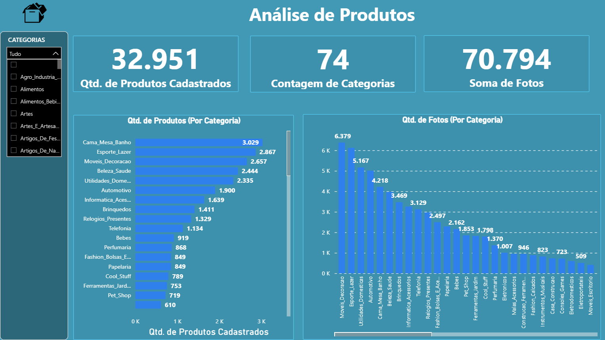

# 📊 Análise de Produtos – Olist (Power BI)

## 🧠 Contexto do Projeto

Este projeto foi desenvolvido com o objetivo de analisar a **distribuição do catálogo de produtos **, utilizando uma base pública amplamente usada em estudos de dados. A ideia central foi transformar dados brutos em **informações claras e visuais**, simulando um cenário real de apoio à tomada de decisão.

O dashboard permite entender a concentração de produtos, o comportamento por categoria e a relação com pedidos e formas de pagamento.

---

## 🎯 Objetivo

* Estruturar uma visão clara sobre a distribuição do catálogo de produtos
* Identificar concentração de itens por categoria
* Praticar **modelagem de dados**, **DAX** e **design analítico** no Power BI

---

## 🗂️ Base de Dados

* Base pública da **Olist**
* Dados relacionados a produtos, categorias, pedidos e pagamentos

---

## 🛠️ Ferramentas Utilizadas

* **Power BI**
* **Power Query** – limpeza e transformação de dados
* **DAX** – criação de medidas e indicadores

---

## 🔧 Principais Etapas do Desenvolvimento

* Modelagem de dados no Power Query
* Criação de relacionamentos entre tabelas
* Desenvolvimento de medidas DAX para:

  * Contagem de produtos
  * Soma de fotos por produto
  * Análises por categoria
* Construção de visuais comparativos
* Aplicação de filtros dinâmicos por:

  * Categoria
  * Pedidos
  * Tipo de pagamento

---

## 📈 Principais Análises

* Distribuição de produtos por categoria
* Concentração de itens no catálogo
* Comparação entre categorias mais e menos representativas
* Apoio à identificação de padrões de comportamento por segmento

---

## 📷 Prints do Dashboard

### Visão Geral

### Análise de Pedidos

### Dashboard com Filtros
  
---

## 🔗 Acesso ao Projeto

* **Dashboard Power BI (publicado):** [https://sl1nk.com/Msf4E](https://sl1nk.com/Msf4E)

---

## 📌 Conclusão

Este projeto contribuiu para o aprimoramento das minhas habilidades em **Power BI**, principalmente em **modelagem de dados**, **DAX** e **visualização analítica**, reforçando a importância de dashboards claros para análise de dados aplicada ao negócio.

